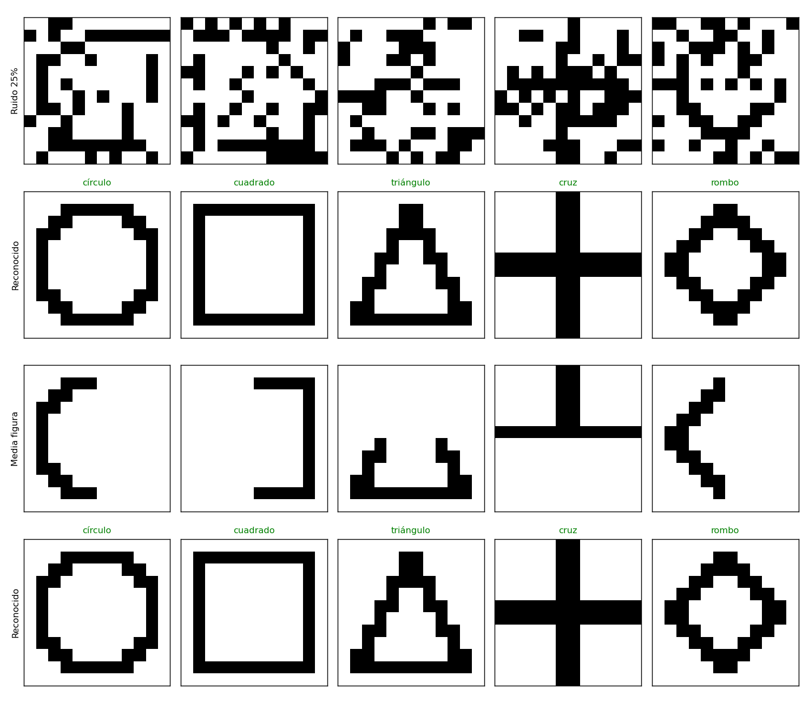
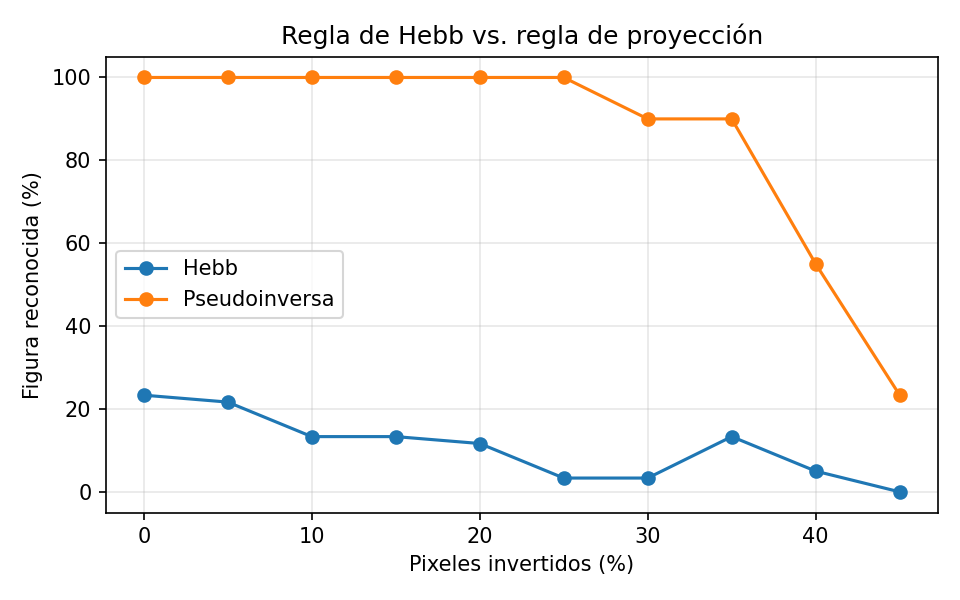
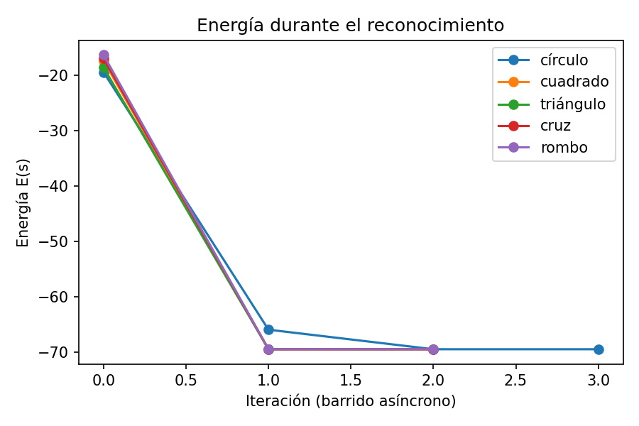
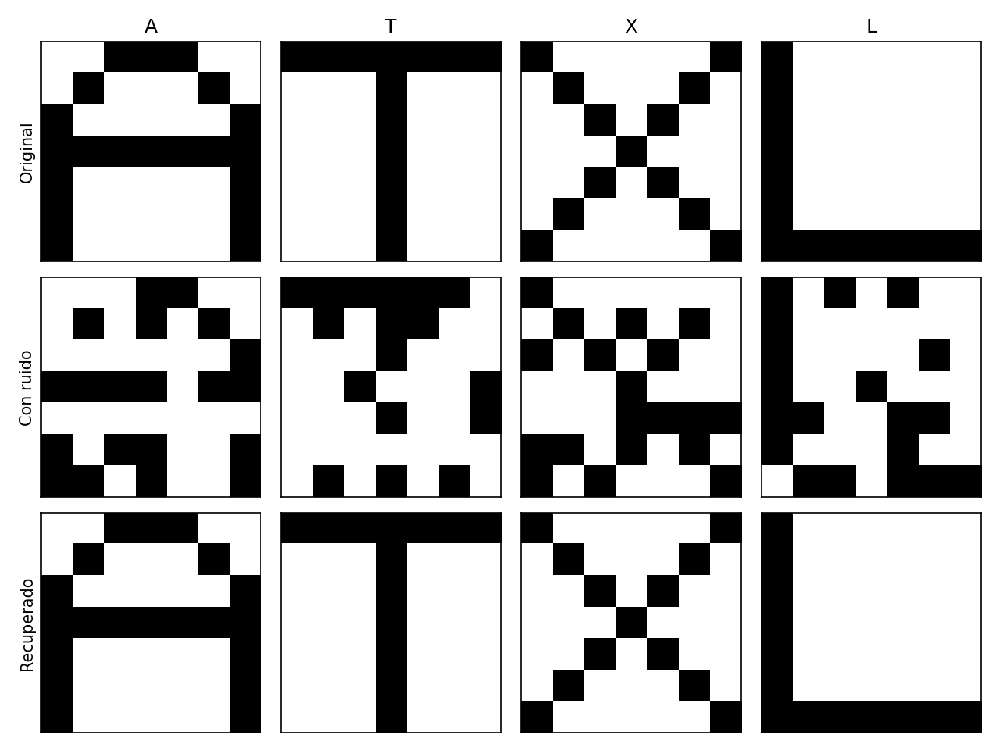
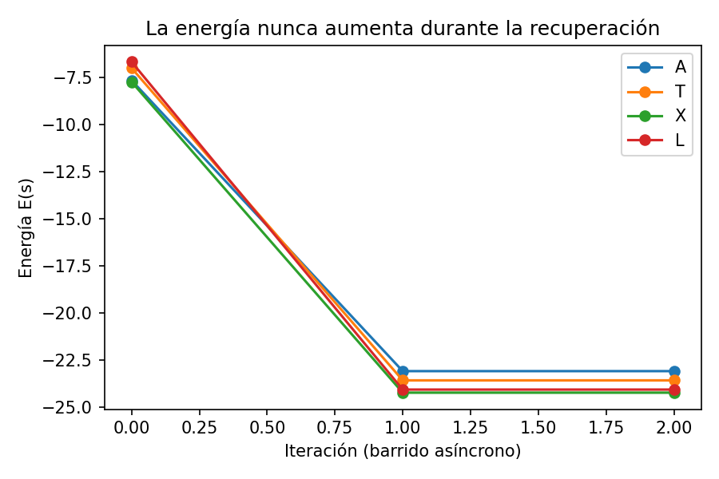
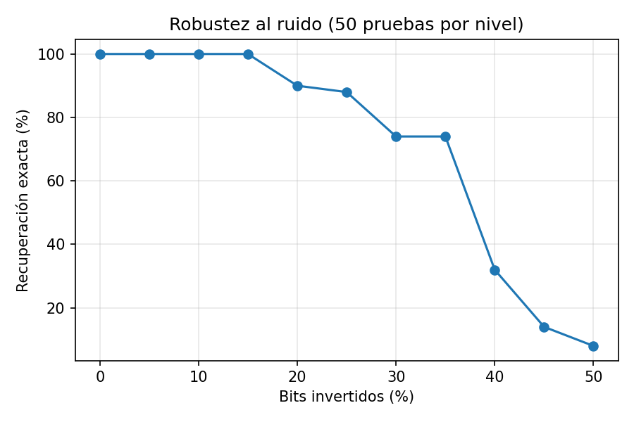

# Red de Hopfield

Implementación en Python (NumPy) de una red de Hopfield discreta como memoria asociativa, en dos partes:

1. **Reconocimiento de figuras** (círculo, cuadrado, triángulo, cruz y rombo de 12×12): la red reconoce la
   figura aunque tenga ruido, le falte la mitad o esté dibujada a mano. → [Reconocimiento de figuras](#reconocimiento-de-figuras)
2. **Letras** de 7×7 (A, T, X, L) recuperadas a partir de versiones con ruido.

**Autor:** Daniel Alfredo Barreras Meraz (A01254805) · TC3002B.570, Desarrollo de aplicaciones avanzadas de ciencias computacionales · Tec de Monterrey

## Cómo funciona

| Concepto | Fórmula | Dónde |
|---|---|---|
| Estados | neuronas bipolares, `s_i ∈ {-1, +1}` | `hopfield/network.py` |
| Aprendizaje (regla de Hebb) | `W = (1/N) Σ_p x_p x_pᵀ`, con `W_ii = 0` | `train(rule="hebb")` |
| Aprendizaje (proyección) | `W = Xᵀ (X Xᵀ)⁻¹ X`, con `W_ii = 0` | `train(rule="pseudoinverse")` |
| Actualización | `s_i ← sign(Σ_j W_ij s_j)` | `HopfieldNetwork.recall` |
| Energía | `E(s) = -½ sᵀ W s` | `HopfieldNetwork.energy` |
| Capacidad | ≈ 0.138 N patrones | `HopfieldNetwork.capacity` |

- **Pesos simétricos y sin autoconexiones.** Con esas dos condiciones, cada actualización asíncrona
  (una neurona a la vez) no aumenta la energía, así que la red siempre llega a un punto fijo.
- **Patrones como mínimos.** Los patrones entrenados quedan como mínimos locales de la energía. Un patrón
  con ruido "cae" al mínimo más cercano, que normalmente es el patrón original.
- **Modo síncrono.** `recall(mode="sync")` actualiza todas las neuronas a la vez. Es más rápido, pero
  puede oscilar entre dos estados; por eso el modo por defecto es el asíncrono.
- **Capacidad.** Con 49 neuronas, la capacidad teórica es de unos 6.8 patrones; se usan 4. Si se guardan
  más patrones de los que soporta, o patrones muy parecidos entre sí, aparecen estados espurios
  (mezclas que no corresponden a ningún patrón).

## Uso

```bash
pip install -r requirements.txt
python shapes_demo.py          # figuras: Hebb vs. pseudoinversa, ruido y media figura
python recognize.py examples/*.txt   # reconoce figuras dibujadas a mano en texto
python demo.py                 # letras: 20 % de ruido, semilla 7
python demo.py --noise 0.3     # otro nivel de ruido
python -m unittest discover -s tests -t . -v
```

```python
from hopfield import HopfieldNetwork, add_noise, letter_patterns

names, patterns = letter_patterns()
net = HopfieldNetwork(patterns.shape[1]).train(patterns)
recovered, energies = net.recall(add_noise(patterns[0], 0.2))
```

## Reconocimiento de figuras

`hopfield/shapes.py` genera cinco figuras de 12×12 (144 neuronas) a partir de fórmulas: un anillo para el
círculo, el borde de un cuadrado, los lados de un triángulo, una cruz y un rombo (`|x| + |y| = r`). Cada
figura es un vector bipolar: +1 en el trazo y -1 en el fondo.

**Reconocer** (`hopfield/recognition.py`) es dejar que la red converja desde la imagen de entrada y comparar
el estado final con las figuras guardadas mediante el traslape `m = s·p / N`. Si `|m| ≥ 0.95` la figura se
reconoce; si es negativo, la red llegó al negativo de la figura (que también es un mínimo de energía); si
ninguna figura pasa el umbral, la red cayó en un estado espurio y la entrada se reporta como no reconocida.

### Por qué la regla de Hebb no alcanza aquí

Las figuras comparten casi todo el fondo, así que se parecen mucho entre sí (el círculo y el cuadrado tienen
un traslape de 0.67). La regla de Hebb supone patrones casi ortogonales: con figuras correlacionadas, la
interferencia entre patrones (crosstalk) es más grande que la señal y **cuatro de las cinco figuras ni
siquiera son puntos fijos**; la red las convierte en mezclas. Por eso se agregó la **regla de proyección
(pseudoinversa)**, `W = Xᵀ (X Xᵀ)⁻¹ X`: proyecta cualquier estado sobre el espacio que generan las figuras,
de modo que cada una queda como punto fijo exacto mientras sean linealmente independientes. La matriz sigue
siendo simétrica y con diagonal en cero, así que la energía sigue sin aumentar en cada paso.

| | círculo | cuadrado | triángulo | cruz | rombo |
|---|---|---|---|---|---|
| Hebb | espurio | espurio | espurio | cruz | espurio |
| Pseudoinversa | círculo | cuadrado | triángulo | cruz | rombo |

### Resultados (`python shapes_demo.py`)

Con la regla de proyección, las cinco figuras se reconocen con 25 % de los pixeles invertidos y también
cuando se borra la mitad de la figura (derecha, izquierda, arriba o abajo):



Porcentaje de figuras reconocidas según el ruido (60 pruebas por nivel):



| Ruido | 0 % | 10 % | 20 % | 25 % | 30 % | 35 % | 40 % | 45 % |
|---|---|---|---|---|---|---|---|---|
| Hebb | 23 % | 13 % | 12 % | 3 % | 3 % | 13 % | 5 % | 0 % |
| Pseudoinversa | 100 % | 100 % | 100 % | 100 % | 90 % | 90 % | 55 % | 23 % |

Hebb apenas acierta incluso sin ruido, porque las figuras guardadas no son estables. Con la pseudoinversa
el reconocimiento es perfecto hasta 25 % de ruido; arriba de 40 % la entrada ya se parece tanto a otra
figura (o al negativo de una) como a la original.



### Figuras dibujadas a mano

`recognize.py` lee dibujos de 12×12 en texto (`#` trazo, `.` fondo). En `examples/` hay un círculo y un
triángulo dibujados a mano, una cruz con huecos y un cuadrado chueco; los cuatro se reconocen:

```
$ python recognize.py examples/triangulo_a_mano.txt
examples/triangulo_a_mano.txt: triángulo  (traslape 1.00, 2 barridos)
  ............   ->   ............
  .....#......   ->   .....##.....
  .....##.....   ->   .....##.....
  ....#.#.....   ->   ....####....
  ....#..#....   ->   ....#..#....
  ...#...##...   ->   ...##..##...
  ...#....#...   ->   ...#....#...
  ..#......#..   ->   ..##....##..
  ..#......#..   ->   ..#......#..
  .#........#.   ->   .##......##.
  .##########.   ->   .##########.
  ............   ->   ............
```

**Limitación:** la red compara pixel por pixel, así que no es invariante a traslación ni a escala. Una figura
movida varios pixeles o mucho más chica que la guardada ya no se parece a su patrón y puede caer en otra
figura o en un estado espurio.

## Letras

### Resultados (`python demo.py`)

Cada letra con 10 de sus 49 bits invertidos (20 %) se recupera exactamente en 2 barridos asíncronos.



La energía baja en cada iteración hasta estabilizarse en el mínimo del patrón:



Porcentaje de recuperación exacta según el nivel de ruido (50 pruebas por nivel):

| Ruido | 0–15 % | 20 % | 25 % | 30 % | 35 % | 40 % | 45 % | 50 % |
|---|---|---|---|---|---|---|---|---|
| Recuperación exacta | 100 % | 90 % | 88 % | 74 % | 74 % | 32 % | 14 % | 8 % |



Hasta 15 % de ruido la recuperación es perfecta. A partir del 40 % el patrón con ruido ya se parece más a
otra letra, o al inverso de un patrón (que también es un mínimo de energía), y la red converge ahí.

## Pruebas

`tests/test_shapes.py` verifica que las figuras sean rejillas bipolares de 12×12, que la regla de proyección
reconozca cada figura con 20 % de ruido y con media figura borrada, que la regla de Hebb falle con estas
figuras, que se detecte una figura invertida y que la matriz de proyección sea simétrica con diagonal en cero.

`tests/test_hopfield.py` (unittest) verifica:
- que la matriz de pesos sea simétrica y tenga la diagonal en cero;
- que los patrones entrenados sean puntos fijos;
- que se recuperen con 10 % de ruido;
- que la energía nunca aumente en modo asíncrono;
- que se rechacen entradas inválidas.

## Estructura

```
hopfield/network.py      red de Hopfield (reglas de Hebb y de proyección) y función de ruido
hopfield/shapes.py       figuras de 12×12, oclusión y lectura de dibujos en texto
hopfield/recognition.py  reconocimiento por traslape con los patrones guardados
hopfield/patterns.py     letras de 7×7
shapes_demo.py           figuras: Hebb vs. pseudoinversa, ruido, media figura, energía
recognize.py             reconoce dibujos de examples/
demo.py                  letras: entrenamiento, recuperación y gráficas
examples/                figuras dibujadas a mano
tests/                   pruebas unitarias
results/                 imágenes generadas por los demos
```

## Referencia

Hopfield, J. J. (1982). Neural networks and physical systems with emergent collective computational
abilities. *Proceedings of the National Academy of Sciences, 79*(8), 2554–2558.
https://doi.org/10.1073/pnas.79.8.2554

Personnaz, L., Guyon, I., & Dreyfus, G. (1986). Collective computational properties of neural networks: New
learning mechanisms. *Physical Review A, 34*(5), 4217–4228. https://doi.org/10.1103/PhysRevA.34.4217
